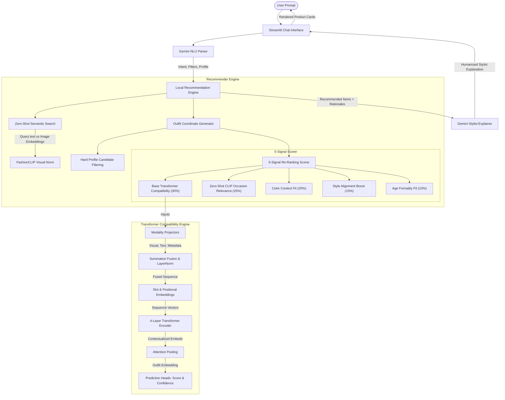

Outfit_Recommendation_System
## Assignment: AI Fashion Outfit Recommendation System

Outfit_Recommendation_System act as an Conversational styling, major goal of this project is to recommend compelte outfit based on user's natural language query rather than just similar clothing items.
for example, if you can say "I need something to wear for bussiness meeting", the system understands the intent, retrievs suitable clothing items and explain why those items go well together.

To build it i used fashion clip, which is a vision language model trained specifically for fashion. I generated embedding for all the products and images and text description before hands and stored them. when a user enters a query, I convert the query into a embedding using the same model and perform vectore similarity search to retrieve the most relavnt products efficiently.

After retrieving candidate item, I apply meta data filtering like gender, ocassion, and clothing category. Then i use a rule based compatibility engine to build a complete outfit, for example pairing a formal shirt with matching trousers, shoe and accessories instead of recommanding a single item.
Finally I integrated the gemini api to generate natural language explination so the system not only recommand an outfit but also explains why this color,styles and combining all suitable for this user's request. The entire application is build using strealit, providing an interactive converstional interface.

Through this project, I gained hands on experience with multi-model AI model, vector embedding , similarity search, recommendation system, prompt engineering and building end to end AI system.
---

## 📁 Project Directory Structure

```text
Outfit_Recommendation_System/
├── README.md                               # Project documentation
├── PROBLEM_STATEMENT.md                    # Problem statement and project objectives
│
├── app.py                                  # Streamlit application entry point
├── recommender.py                          # Recommendation engine and outfit generation logic
│
├── fashion_recommendation_assistant.ipynb  # Development & experimentation notebook
│
├── products.csv                            # Product metadata (68 fashion items)
├── outfits.csv                             # Curated outfit mappings
├── curated25.xlsx                          # Original curated outfit dataset
│
├── visual_embeddings.npy                   # Precomputed FashionCLIP image embeddings
├── text_embeddings.npy                     # Precomputed FashionCLIP text embeddings
├── sim_matrix.npy                          # Similarity matrix for fast retrieval
├── fashion.index                           # FAISS vector index
│
├── images/                                 # Product image dataset
│   ├── ajio/                               # Images scraped from Ajio
│   ├── myntra/                             # Images scraped from Myntra
│   └── nykaa/                              # Images scraped from Nykaa
│
├── pre_extract.py                          # Embedding preprocessing utilities
├── pre_extract_fashionclip.py              # FashionCLIP feature extraction script
│
├── create_notebook.py                      # Notebook generation utility
├── append_section_7.py                     # Notebook helper script
├── fix_create_notebook_newlines.py         # Formatting utility
├── patch_create_notebook.py                # Notebook patch script
├── patch_create_notebook_2.py              # Notebook patch script
├── patch_create_notebook_3.py              # Notebook patch script
├── run_notebook.py                         # Notebook execution helper
│
└── .gitignore                              # Git ignore configuration
```

---

## 📊 Data Files Description

### 1. `products.csv`
This file contains the core metadata for the 68 unique fashion items that make up our outfits.
* **Fields**:
  * `id`: Unique identifier for the product (e.g., `ajio_703182002`).
  * `name`: Product title (e.g., `Women Bodycon Midi Length Dress`).
  * `brand`: Manufacturer or label (e.g., `Fyre Rose`, `Peter England`).
  * `price_inr`: Retail price in Indian Rupees (INR).
  * `rating` / `rating_count`: Customer rating statistics.
  * `gender`: Target gender (`men` / `women`).
  * `wear_type`: Style category (e.g., `western`, `ethnic`).
  * `category` & `category_label`: Specific clothing/accessory category (e.g., `formal-shirts`, `heels`, `dresses`).
  * `occasion`: Intended setting (e.g., `party`, `office`, `casual`).
  * `tags`: Semicolon-separated tags for retrieval.
  * `description`: Detailed text description of the product.
  * `image`: Relative filepath to the product image (e.g., `images/ajio/703182002.jpg`).

### 2. `outfits.csv` (and `curated25.xlsx`)
This file defines 25 expert-curated complete outfits. You can use this file as ground truth for training, evaluation, or as reference combinations.
* **Fields**:
  * `outfit_id`: Unique identifier for the outfit (e.g., `outfit W1`).
  * `gender` / `wear_type` / `occasion` / `theme`: Categorization context.
  * `hero` & `hero_id`: The main item in the outfit (e.g., a dress or shirt).
  * `second` & `second_id`: The complementary item (e.g., trousers/chinos).
  * `layer` & `layer_id`: Optional layering item (e.g., blazers, jackets).
  * `footwear` & `footwear_id`: Footwear item.
  * `accessory_1` & `accessory_1_id` / `accessory_2` & `accessory_2_id`: Optional styling accessories.
  * `palette`: Main color combination.
  * `stylist_rationale`: Stylist commentary explaining why this outfit is compatible and fits the theme.

---

## 🚀 Quick Start Code (Python)

You can load and start exploring this dataset using the following snippet:

```python
import pandas as pd
import os

# Set paths
DATASET_DIR = "./"  # Update path if run from elsewhere
products_df = pd.read_csv(os.path.join(DATASET_DIR, "products.csv"))
outfits_df = pd.read_csv(os.path.join(DATASET_DIR, "outfits.csv"))

print(f"Loaded {len(products_df)} products.")
print(f"Loaded {len(outfits_df)} curated outfits.")

# Example: Display first outfit
first_outfit = outfits_df.iloc[0]
print(f"\nOutfit ID: {first_outfit['outfit_id']} ({first_outfit['theme']})")
print(f"Hero Item: {first_outfit['hero']} (ID: {first_outfit['hero_id']})")
print(f"Footwear: {first_outfit['footwear']} (ID: {first_outfit['footwear_id']})")
print(f"Rationale: {first_outfit['stylist_rationale']}")
```

---

## ⚙️ Setup & Execution Instructions

Follow these steps to run the interactive fashion stylist chatbot and verification pipelines locally:

### 1. Prerequisites
- Python 3.10 or higher.
- A Gemini API Key (get one for free at [Google AI Studio](https://aistudio.google.com/)).
- A GPU is recommended for first-time feature extraction but the app runs instantaneously on CPU using pre-extracted embedding caches.

### 2. Clone the Repository
```bash
git clone https://github.com/kartik4u2002/Fashion-Recommendation.git
cd Fashion-Recommendation
```

### 3. Install Dependencies
Install all required libraries including Streamlit, Hugging Face Transformers, PyTorch, FAISS, and AVIF image plugins:
```bash
pip install streamlit google-generativeai transformers sentence-transformers faiss-cpu torch torchvision matplotlib seaborn pandas numpy pillow-heif pillow-avif-plugin scikit-learn tqdm
```

### 4. Configure Gemini API Key
Create a `.env` file in the project root directory and add your Gemini API key:
```env
GEMINI_API_KEY=your_actual_gemini_api_key_here
```
*(The Streamlit app is configured to automatically read this key on launch).*

### 5. Launch the Chatbot App
Start the interactive Streamlit chatbot application:
```bash
python -m streamlit run app.py
```
This will start the local server and open the web app in your default browser at `http://localhost:8501`.

### 6. Verify and Run the Notebook Pipeline
To verify the complete ML engineering pipeline (including dataset analysis, FashionCLIP hybrid embeddings, FAISS indexing, evaluation against ground truth, and PCA visualizations), execute:
```bash
python run_notebook.py
```
This will run all cells in `fashion_recommendation_assistant.ipynb` top-to-bottom and save the executed outputs.

---

## 🏛️ System Architecture

The AI Fashion Stylist system is built on a hybrid architecture that integrates **vector search**, **semantic NLU parsing**, **context-aware rule engines**, and **LLM generation**.

Here is the overall workflow of the conversational stylist:



### 1. Outfit Compatibility Engine
The compatibility engine has been upgraded from simple rule-based and pairwise similarity metrics to a **Multimodal Transformer Compatibility Model** (`FashionTransformerCompatibilityModel`) that processes a sequence of fashion items to predict compatibility and confidence scores.

#### Architecture Details:
* **Modality Projectors**:
  * **Visual Projector**: A multi-layer perceptron (MLP) projecting 512-dimensional **FashionCLIP** visual embeddings to a joint 512-dimensional space.
  * **Text Projector**: An MLP projecting 512-dimensional **FashionCLIP** text embeddings to the same joint 512-dimensional space.
  * **Metadata Projector**: Learns low-dimensional embedding representations for 10 attributes (Category, Color, Occasion, Season, Gender, Style, Material, Pattern, Brand, Fit), concatenates them, and projects them to 512 dimensions.
* **Modality Fusion**: Adds visual, text, and metadata projections together, followed by Layer Normalization and Dropout for regularization.
* **Slot & Positional Embeddings**: Adds learned slot embeddings (mapping items to slots: `Topwear`, `Bottomwear`, `Footwear`, `Layer`, `Accessory`, or `Pad`) and position embeddings to preserve order and structure in the outfit sequence.
* **Transformer Encoder**: Employs a 4-layer Transformer Encoder (8 attention heads, 512 hidden dimension, 2048 feedforward dimension) to capture deep contextual interactions and styling relations among all items in the outfit.
* **Attention Pooling**: Aggregates the contextualized sequence of item embeddings into a single outfit embedding using a query-based attention mechanism.
* **Compatibility & Confidence Heads**: Uses dedicated linear classification heads to output:
  * **Compatibility Score**: Continuous value in $[0, 1]$ indicating outfit cohesion.
  * **Confidence**: Continuous value in $[0, 1]$ indicating the model's prediction certainty.

---

### 2. User & Context-Aware Recommendations
To provide personalized recommendations matching user situations, the engine re-ranks candidate products using 4 profile parameters (Gender, Age Group, Occasion, Style Preference) across 5 scoring signals:

1. **Base Styling Compatibility (30% weight)**: Calculated via the Multimodal Transformer Compatibility Model score.
2. **Occasion Relevance (25% weight)**: Replaces rule-based category list mappings with a **zero-shot text-to-image similarity check**. It encodes descriptive occasion text targets (e.g., `"business formal office wear"` for `Office`) via FashionCLIP's text encoder and computes the cosine similarity against the candidate product's image embedding (`visual_norm`).
3. **Color Context (20% weight)**: Scores color alignment depending on the occasion profile (e.g. neutral colors for office, bright/bold colors for parties).
4. **Style Preference (15% weight)**: Boosts product types aligned with the user's specific preference (e.g. Streetwear boosts sweatshirts, sneakers, and track pants).
5. **Age Formality Fit (10% weight)**: Measures the formality deviation between age-group styling targets (e.g. younger 20s prefer relaxed formality; mature 50s+ prefer structured formality) and candidate product category formalities.

---

## 📊 Dataset Analysis & EDA Summary

A comprehensive exploratory data analysis of the cloned dataset was performed in the notebook:
* **Total Products**: 68 unique products.
* **Curated Outfits**: 25 expert-curated outfits (ground-truth reference pairs).
* **Category Distribution**: 47 unique categories (e.g. `formal-shirts`, `party-dresses`, `jeans`, `running-shoes`), indicating a high degree of class variety but significant class imbalance (many categories contain only 1 item).
* **Color Palette Distribution**: Main colors were extracted from text descriptions, with Red (9), White (8), Black (8), Navy Blue (8), Brown (8), and Grey (4) making up the top colors.
* **Image Resolutions**:
  * Widths range from 256px to 420px (Mean: 370.8px).
  * Heights range from 341px to 560px (Mean: 494.3px).
* **Dataset Challenges Addressed**:
  * **AVIF Images**: 28 of the 68 product images are encoded as AVIF format but saved with `.jpg` extensions. Standard Pillow (`PIL.Image`) crashes on these without the `pillow-avif-plugin` installed and explicitly imported in the notebook.
  * **Metadata Gaps**: The original `products.csv` lacks an explicit "color" column. We successfully extracted colors by matching names and descriptions against a strict target color list.

---

## 📓 What's Inside the Notebook (`fashion_recommendation_assistant.ipynb`)

The notebook contains 8 sections, structured as follows:

* **## SECTION 0: Setup & Install**
  * Core imports and dependency installations.
  * Explicit loading of the `pillow-avif-plugin` to register the AVIF decoder.
  * Verification of the T4 GPU runtime.
* **## SECTION 1: Dataset Analysis & EDA**
  * Automated repository cloning and path setup.
  * Core pandas analysis (shapes, null counts, unique value prints).
  * Seaborn distribution plots (category count, color count, and gender/occasion count).
  * Matplotlib 5x5 product image grid with text overlay (robustly wrapped in try/except).
  * Markdown summary documenting image statistics.
* **## SECTION 2: Feature Extraction Pipeline**
  * **2a (Text)**: Encodes concatenated metadata using the pretrained **FashionCLIP** text encoder into 512-dimensional text embeddings.
  * **2b (Visual)**: Extracts image features using the **FashionCLIP** vision encoder into 512-dimensional visual embeddings.
  * **2c (Multimodal Hybrid Indexing)**: Normalizes both modalities, averages them to create a hybrid multimodal representation, and builds a FAISS `IndexFlatIP` (Inner Product) index.
* **## SECTION 3: Outfit Compatibility Engine**
  * **3a**: A dictionary mapping each article category to its compatible categories.
  * **3b**: Color harmony logic handling neutral pairings and classic style matches.
  * **3c**: Compatibility Scorer computing: `Score = 0.4*category_match + 0.3*color_harmony + 0.3*embedding_similarity` and returning natural language explanations.
  * **3d**: Outfit Generator that builds coord-outfits (top, bottom, footwear, accessories) around any seed item.
* **## SECTION 4: Chat-based Fashion Assistant**
  * **4a**: Keyword-based intent parser detecting search, outfit generation, compatibility checks, and style advice, preserving the original query text.
  * **4b**: Conversational response builder leveraging **FashionCLIP** to execute zero-shot text-to-image semantic search by ranking image embeddings (`visual_norm`) against the query text embedding.
  * **4c**: Interactive `ipywidgets` chat widget with styled bubbles and a print-based `chat_simulation()` fallback.
* **## SECTION 5: Evaluation & Visualization**
  * **5a (Quantitative Evaluation)**: Validates the engine against the 25 curated outfits in `outfits.csv`.
    * *Curated Outfits Score*: **0.785 ± 0.052** (with 100% scoring above `0.7`).
    * *Random control baseline*: **0.448**.
    * Plots a density comparison histogram.
  * **5b (Visual Showcase)**: Renders a 1x4 horizontal image grid showing 5 diverse seeds and their recommended outfit items.
  * **5c (PCA Cluster Visualization)**: Projects hybrid embeddings to 2D using PCA, color-coded by master category (Apparel, Footwear, Accessories), annotated with typical categories.
* **## SECTION 6: Demo Showcase Cell**
  * Demonstrates three end-to-end examples with output: text search queries, outfit generation from a seed item, and a simulated 5-turn conversation transcript.
* **## SECTION 7: User & Context-Aware Recommendations**
  * **7a (User Profile)**: Defines the `UserProfile` dataclass mapping gender, age group, occasion context, and style preferences.
  * **7b (Context Mappings)**: Implements static rules for preferred styles, preferred colors, and avoided types per occasion and age segment.
  * **7c (Candidate Filtering)**: Eliminates gender-incompatible products and excluded items per occasion context.
  * **7d (Context Scorer)**: Re-ranks products using a 5-signal soft scoring formula: Base Similarity (30%), Occasion Relevance (25% calculated as the zero-shot cosine similarity between candidate visual embeddings and target occasion text descriptions encoded by FashionCLIP), Color Context (20%), Style Alignment (15%), and Age Formality (10%).
  * **7e (Profile Outfit Generator)**: Compiles outfits matching slots based on context-aware scores.
  * **7f (Profile Chat)**: Parses natural language queries to extract user profiles and overrides dropdown settings.
  * **7g (Profile Chat Dashboard & Demo)**: Builds an interactive widget dashboard with dropdown selectors and executes a static demo printing outcomes for 5 diverse test queries with detailed signal score breakdowns.


